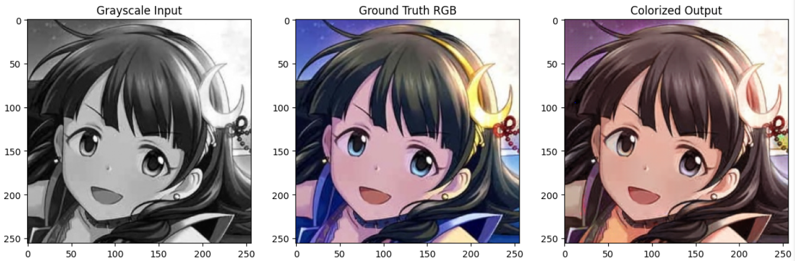
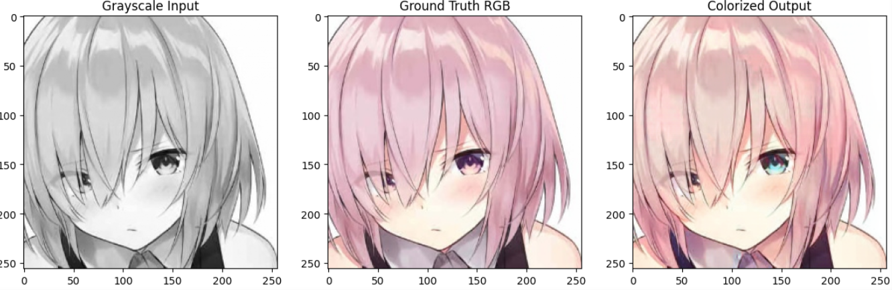
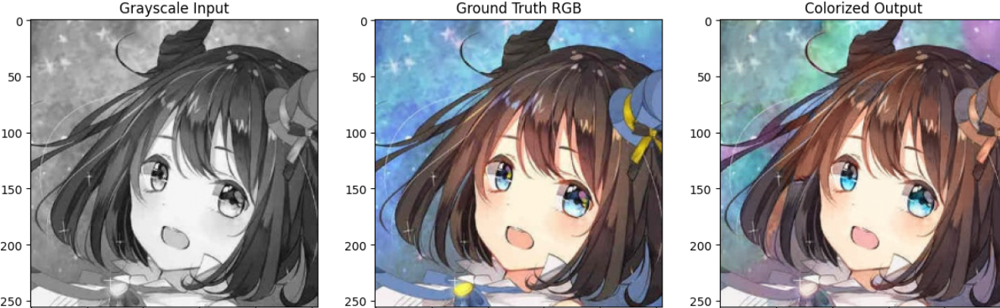
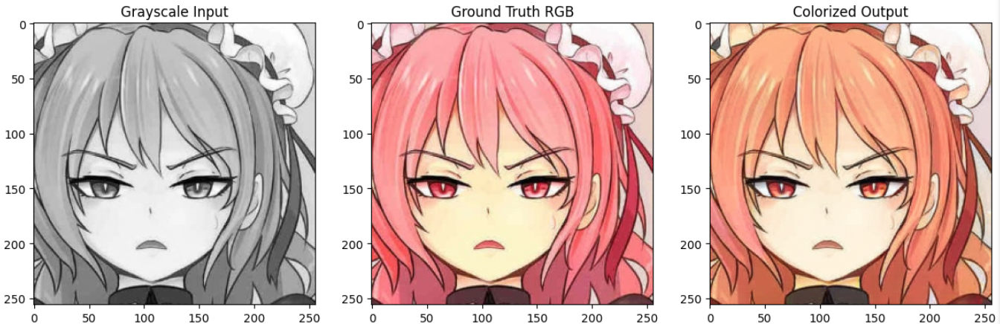

# HueNet 🎨 - Sketch-to-Art

HueNet is a **GAN-based sketch-to-art model** designed to transform black-and-white sketches into vibrant and detailed colored artworks.  
It utilizes a **U-Net generator**, a **CNN discriminator**, and **VGG-based perceptual loss** to enhance realism.  

## ✨ How It Works  
 
2. **Generator (U-Net)**: Converts a sketch into a colored artwork.  
3. **Discriminator (CNN)**: Evaluates real vs. generated images.  
4. **VGG Feature Loss**: Uses a pre-trained **VGG network** to compare high-level features, improving realism.  
5. **Training Process**:  
   - The GAN minimizes adversarial loss to fool the discriminator.  
   - Perceptual loss ensures that the generated images retain high-level details.  

## 🏗️ Model Architecture  

- **Generator**: U-Net with ResNet-style blocks.  
- **Discriminator**: CNN-based binary classifier.  
- **VGG-based Perceptual Loss**: Extracts high-level features for better style and detail retention.  
- **Loss Functions**:  
  - **Adversarial Loss** (GAN loss)  
  - **L1/L2 Loss** (Pixel-wise comparison)  
  - **Perceptual Loss** (VGG feature similarity)  

## 🚀 Features  

- **Sketch-to-Art Transformation**: Converts black-and-white sketches into colored artwork.  
- **GAN-based Model**: Learns through adversarial training for sharper results.  
- **VGG-Enhanced**: Uses a pre-trained VGG network to improve colorization quality.  
- **Multiple Loss Functions**: Ensures both structure and style consistency.
  
## Results

More images can her found [here](https://github.com/Aryan-Palimkar/Hue-Net/tree/main/images)
